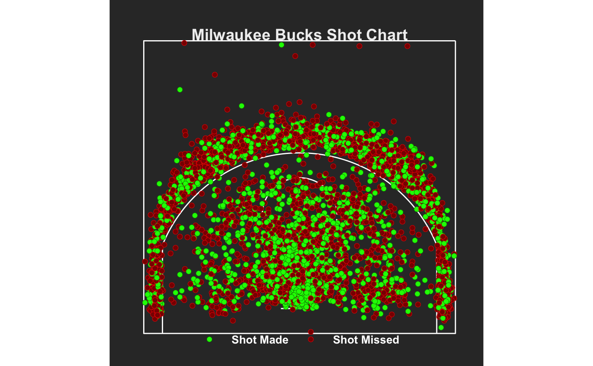
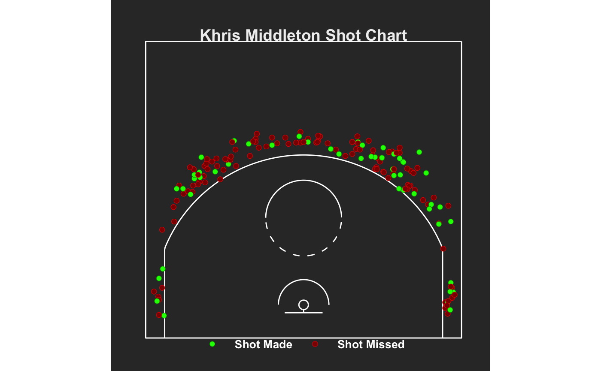

{width="1000"}

When creating the shot chart for the 2023 Milwaukee Bucks I came across a series of findings and produced a detailed explanation for them. After analyzing the shot chart I can confidently say that there are ideas which I think can be executed in a better fashion to tailor this program towards a winning standard.

Key findings:

-   High volume in the paint

-   Three-point concentration

-   Efficiency variance

-   Mid-range neglect

-   Corner three cold spot

Detailed Explanation:

-   The shot chart around the rim suggests that the scoring near the rim is a higher percentage shot than anywhere else on the court. Makes sense when Giannis and Brook are in the game because of their height and finishing ability.

-   To deter the high volume shots in the paint, teams have started taking away driving lanes leading to kick-outs for three-pointers. The dense cluster of shots beyond the three-point-arc determines that there are shots taken at all spots, but the chunk of misses come from the corners–indicating to stay away from those shots.

-   The distribution of red dots beyond the three-point-line suggest that adjustments should be made to give the players the best chance of hitting shots, leading to a better chance for the team to win. If we break it down into individual charts we can better player development and design new plays to best suit the players.

-   There are not a lot of shots, in comparison, from the 16-24ft range. This has started to become a trend over the years with the influence of three-point shooting and modern trend of spacing. While they are not worth as much as a three-pointer, they are a shot that we should focus on. Other teams 'pack the paint' against us, and now teams have become good at closing out on three-point shooters. The resurgence of mid-range shots is something that could take our team to the next level.

Next I have targeted the team shots and turned them into just Khris Middleton 3pt shot attempts from the 2023 season.

{width="1000"}

Key findings

-   Inefficient from beyond the arc

-   Injury kept his shots low

-   Hard to get into a grove when you do not play much

-   Needs to be more effective from the right side of the court

-   
